

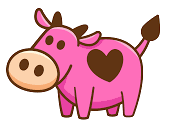
<h1>THE MILK STORE</h1>

## Table of Contents

### [About](#about)
### [Getting Started](#getting_started)
### [Usage](#usage)

---
## About
Introducing the webstore where you can buy the finest glass of milk 🥛
   In this full stack application users can experience the UI provided by `React` and `Tailwind` on the frontend and backend provided by `Express`
   The tech stack for this project includes using `Mongoose` on the backend and `MongoDB` as a database which are still not implemented.
  The application is `Desktop` use only

---
## Getting Started
1. Fork or clone the project. Navigate to the Client and the Server directory each separately and install all dependencies with `npm install` or `npm i`
2. To start the development mode:
   * for the Server run `npm run dev`
   * for the Client run `npm start`
3. If all goes well, the backend will be running on `localhost:8080`✨ and the frontend on `localhost:3000` ✨

---
## Usage
For starters, running `localhost:3000` will take you to the Home page where you can see the main layout.
 

 Features you can find on the main page:  

[Logo Icon](#logo_icon) / [Milk Types Dropdown](#milk_types_dropdown) / [Cart Icon](#cart_icon) / [Search bar](#search_bar) / [Filter](#filter) 

 Features on other pages:  
 [Pagination](#pagination) / [Slider](#slider)
 
 

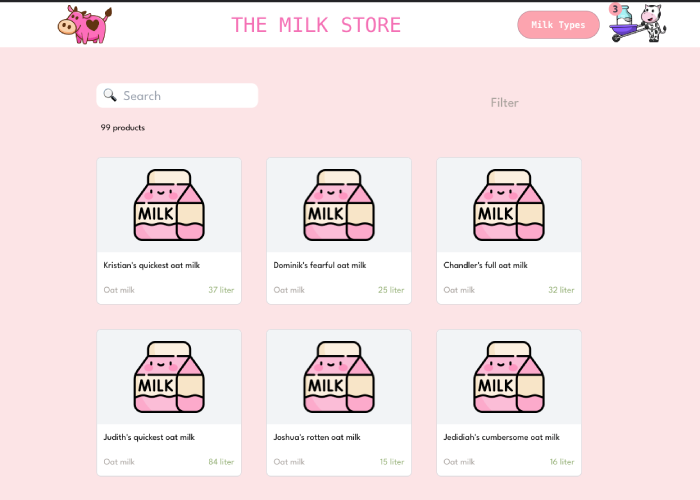

 

Clicking on one of the displayed products it will redirect you to a different page with the details for the chosen product. Among the details you can see the name, type and quantity in stock in liters. Below the details lies the [Slider](#slider) which you can use, to choose the amount of liters you want to purchase. When done, pressing the order button will place the quantity of your desired product in the cart.

 

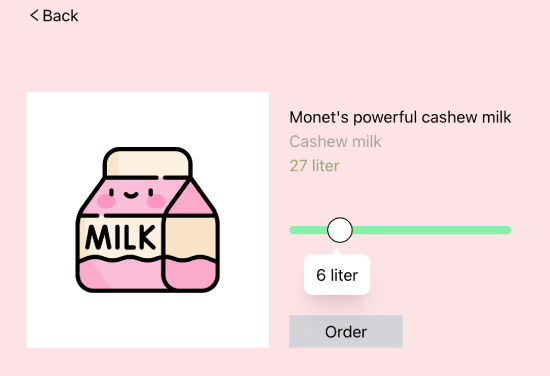

 

## Logo Icon
On the navbar first appear the Logo icon which pressed will redirect you to the Home page.

 

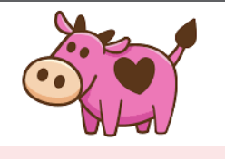

 

#### Milk Types Dropdown
Further away on the right side of the navbar you can find the button for  Milk Types dropdown menu. Pressing the button will show all the types of milk which you can choose from. Choosing one of the types will redirect you to a different page where only products from the chosen type will be displayed. Only 9 products will display and for the users convenience the page will be equipped with [Pagination](#Pagination).

 

 

#### Cart Icon
The Cart icon displays how many products have been chosen for purchase and clicking on it will show a slide menu with all the chosen products (in development)

 

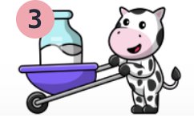

 

#### Search bar
Searching by name is a benefit for reducing the number of all the products displayed on the home page.

 

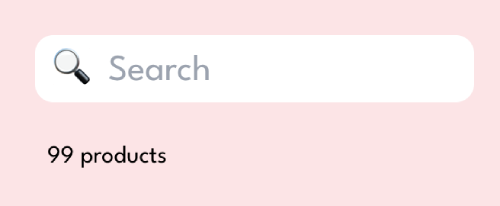
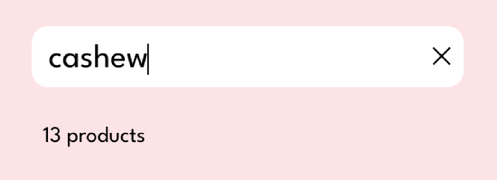

 

#### Filter 
On the home page you can filter the products by their types as well. Pressing on the filter will display a dropdown check box menu.

 

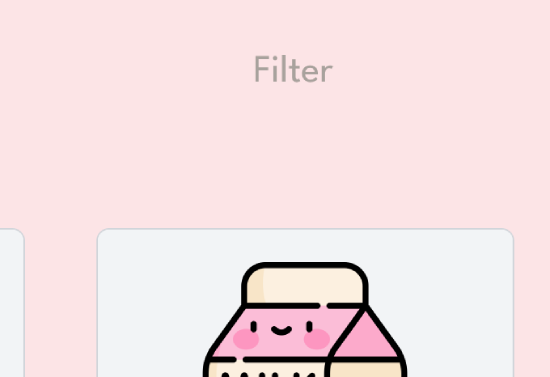
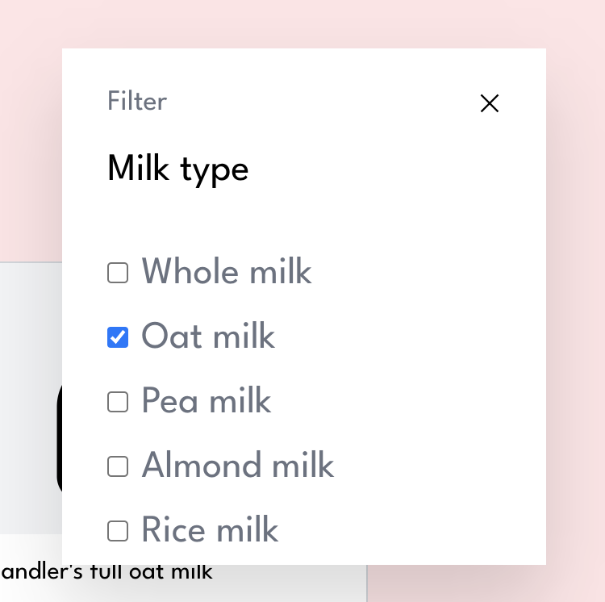

 

#### Pagination 
The pagination shows the current page and the number of pages in total. A Previous and a next button are included.

 

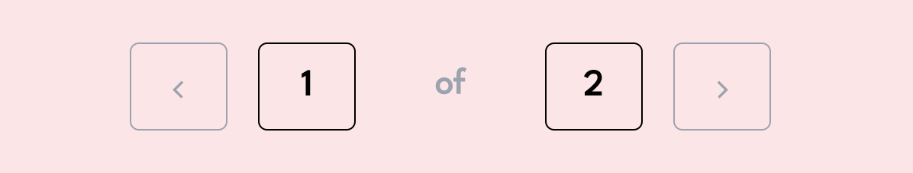

 

#### Slider 
Easy to use slider showing you the amount of liter you have chosen in a interesting shaped bubble.

 

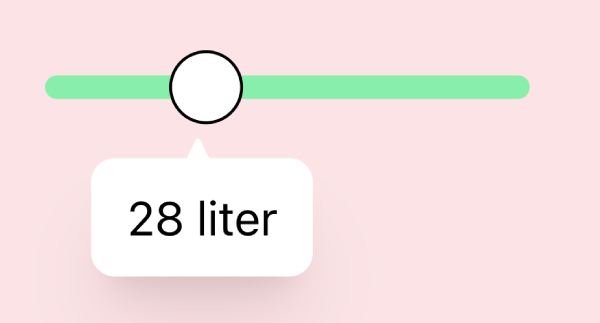

